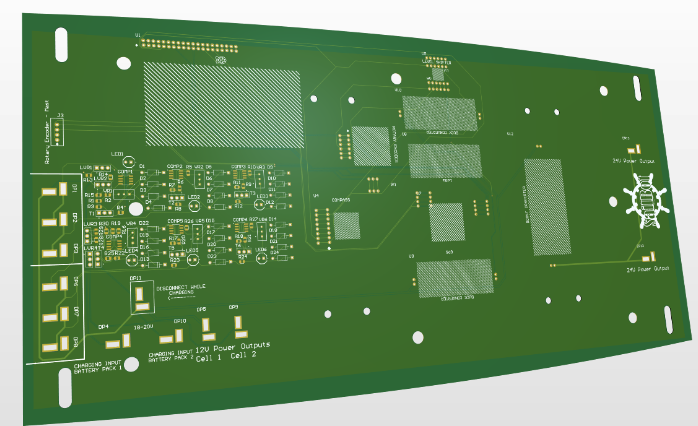
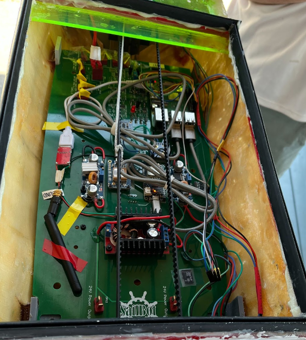
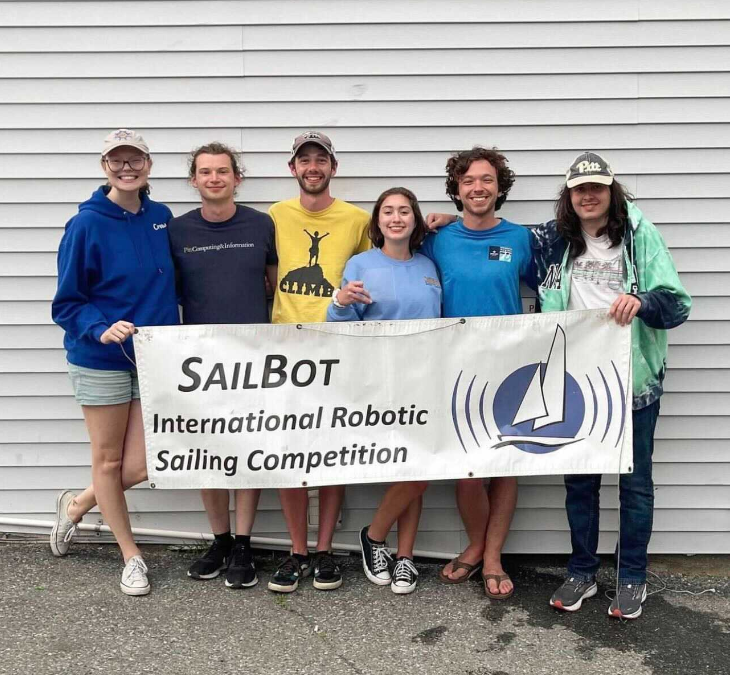

Hurry Up is the name of the second boat built by SailBot at Pitt, named for how long it took to complete. 

My contributions to the were mainly in the electronics hardware, namely the motherboard which served to mount all internal sensors and the MCU (raspberry pi 4). 
Features included are...
- Custom designed BMS to handle power distribution and battery safety/reliability
- Board interfaces that internally route most device to device connections to minimize wire volume
- Unique mechanical contraints that included relying on the motherboard to provide lateral support for the boat's hull

With this boat, we were able to compete in our first ever Internation Robotics Sailing Regatta since the creation of Pitt SailBot. Although there was much to improve upon we were able to take home 3rd place :)

 

