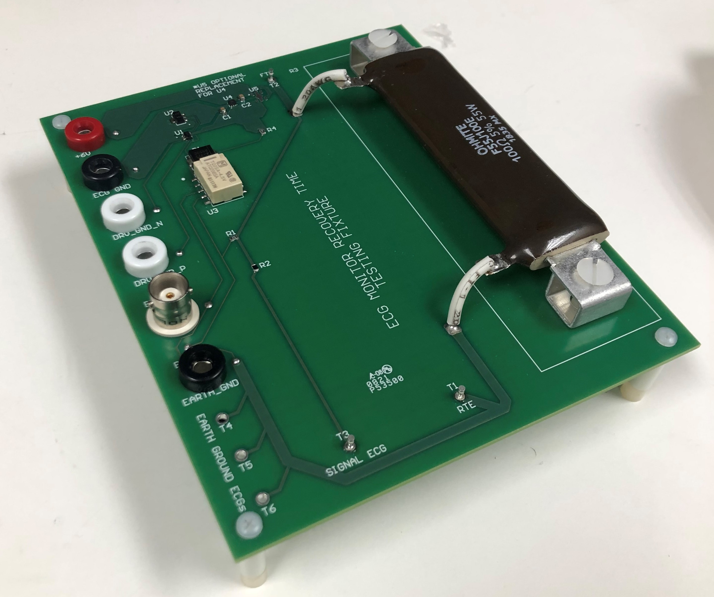
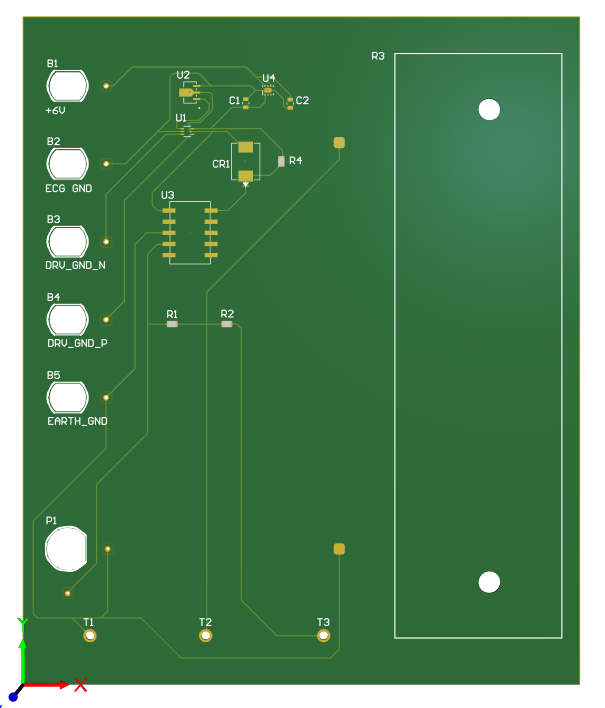

This board is a test fixture built for use in measuring signal integrity shortly after a defibrillation pulse.

Used in official validation procedures of a class 3 medical device.

## Features Inlcude:
- Defibrillation load and suitable HV relay
- Interfacing for 8 unique inputs
- Power control system

All components hand soldered in-house.

