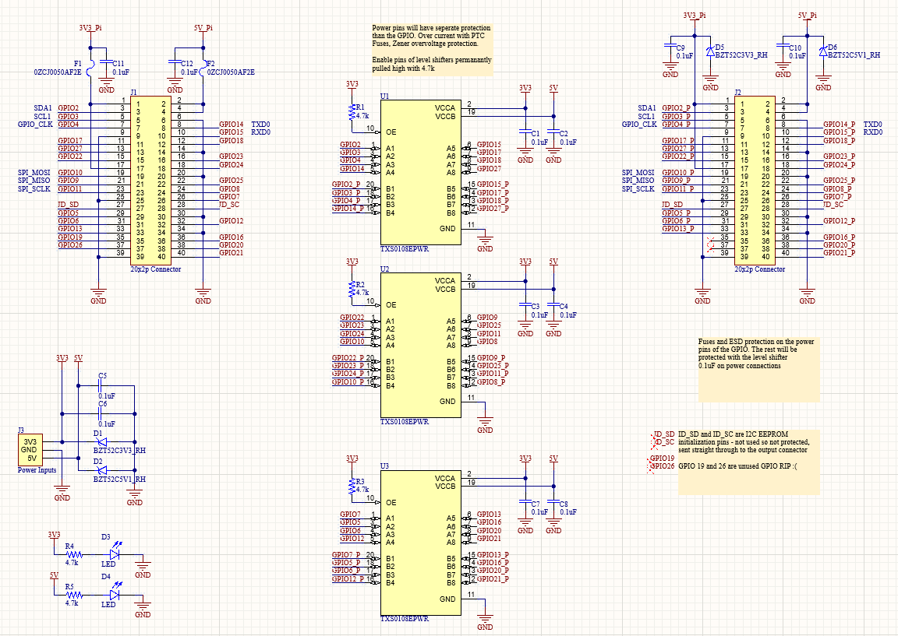

Oct. 2022

After breaking multiple Raspberry Pi's from shorting pins to other, less friendly, contacts I decided that it would be a good idea to create a circuit that would protect those inputs from ESD, overvoltage, and overcurrent. This board would need to work for all data rates from the Pi and protect the power pins of the Pi.

This board takes the 20x2 pinout from the Pi and translates it into an identical but protected output on the right side of the board.

## Components
To protect the GPIO, a bidirectional level shifter was used as a buffer with the idea being that all ESD would be caught safely by the chip and overvoltage/overcurrent faults would break the $2 IC, not the $200 microcontroller. Perhaps in future designs, more components could be added to protect the level shifter but for this implementation replacing a broken IC is more reasonable than assembling a larger and more crowded board.

The TXS0108E from TI was chosen as it has standard ESD protection, forgiving absolute maximum voltage ratings on the A and B side rails, and A and B side voltage levels that work well with the Pi's output levels. This chip can transmit at 50Mbps which is enough for a Raspberry Pi.

3 Chips were used so that all GPIO would be protected, each chip has 8 inputs however which leaves 2 pins unconnected to the protected output (GPIO 19 & 26).
The power pins of the Pi are connected through zeners and polyfuses such that any shorts or voltage mismatches on the protected side won't affect the Pi. Power to the level shifters is drawn from off board, isolated from the power pins of the Pi.
0.1uF decoupling capacitors are placed next to all power ports.	

## Design
The board itself is only 2 layers with a signal/ground and ground plane. Via stitching is done throughout the board and all copper islands are grounded so that switching EMI is reduced and current return paths don't cause any issues (not much of a concern given the clock speed of the Pi but why not :).

JLCPCB fabricated the PCB and components are supplied from various vendors. The boards themselves turned out very well except for a lack of solder mask between the TXS0108E pins but I guess that is what you get from a $22 PCB. All components were hand soldered.
The board dimensions are 1840mil  x  2725mil with a total of 31 components.

