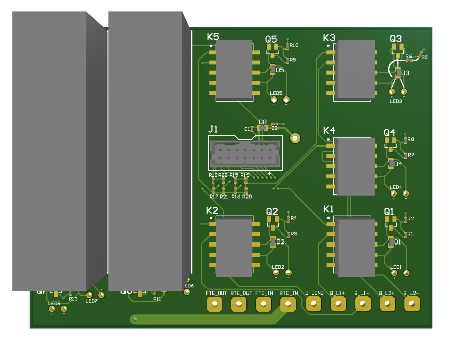
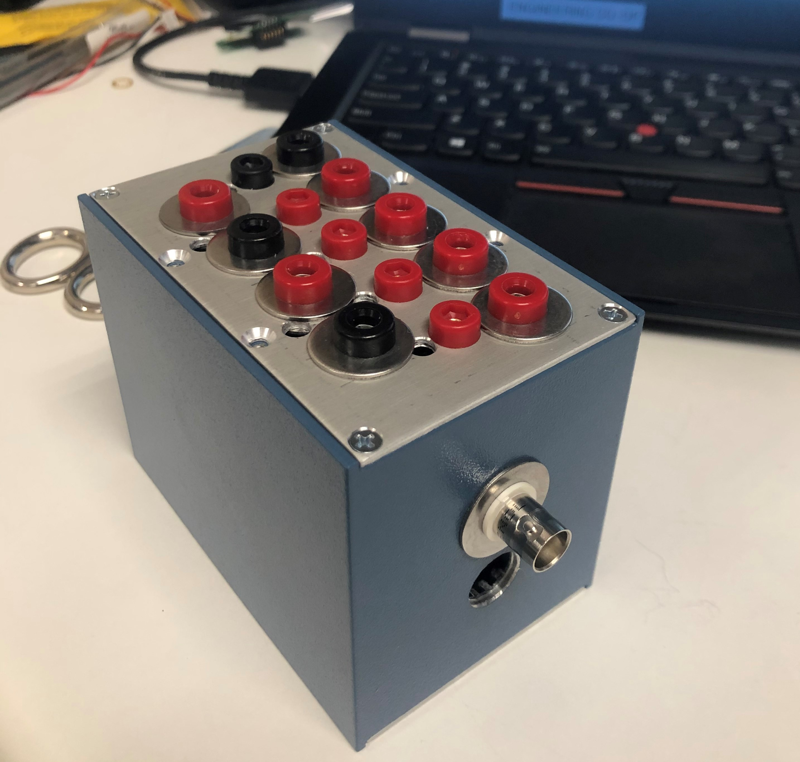

This board was built for triggering and measuring ECG/TE falloff remotely while inside an altitude chamber.

Used in official validation procedures of a class 3 medical device.

## Features Include
- 14 pin interface (J1) to control circuit level logic for remote falloff
- HV relays to withstand a defibrillation pulse
- Designed to interface with various other test fixtures

