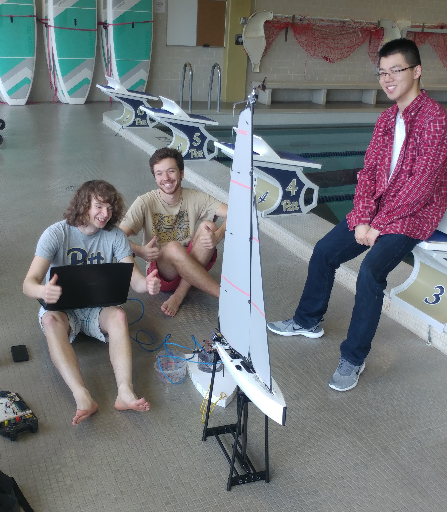

Ship Happens is the name of the first boat built by SailBot at Pitt, aptly named as the competition it was intended to compete in was canceled due to COVID-19.

All design is done as a team but I contributed greatly to electrical components including the...
- Power system
- Wind direction sensor
- GPS implementation

Although this boat was never able to compete, we still learned many new skills and are implementing our knowledge into a new boat for 2022.

