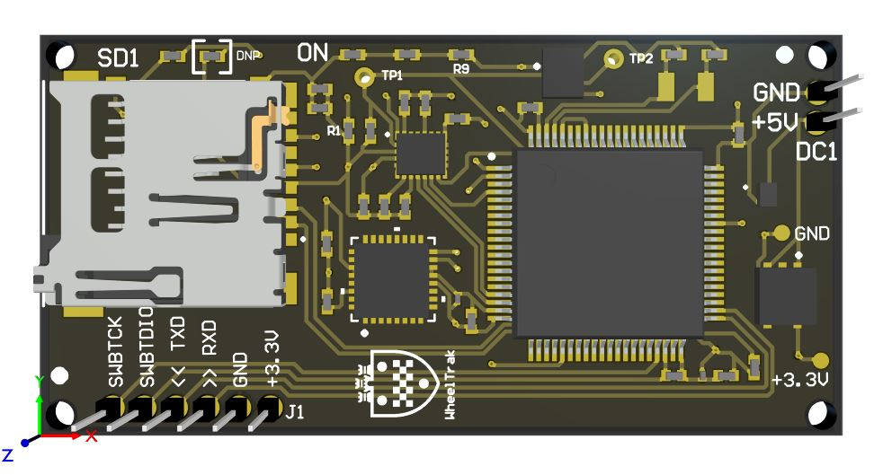

## This board comes equiped with:
- Embedded MSP430 selected for low-power consumption
- Sensors for 9 different data points
- Power control system
- microSD Card interface
- 4 Layers: 2 Signal, power, and ground

Programming was done on the MCU in C++ and peripherals were controlled with I2C

The device is inteded to be mounted on a wheelchair and passively collect data for <6 weeks that will be sent back to an app the user can monitor with their phone. Using this app, you can get information on the condition of specific parts of the wheelchair and stats of daily use.

Think of it like a fitbit for wheelchairs.

This device was made under the advisment of Dr. Anand Mhatre and Dr. Gurleyik Kilichan.

